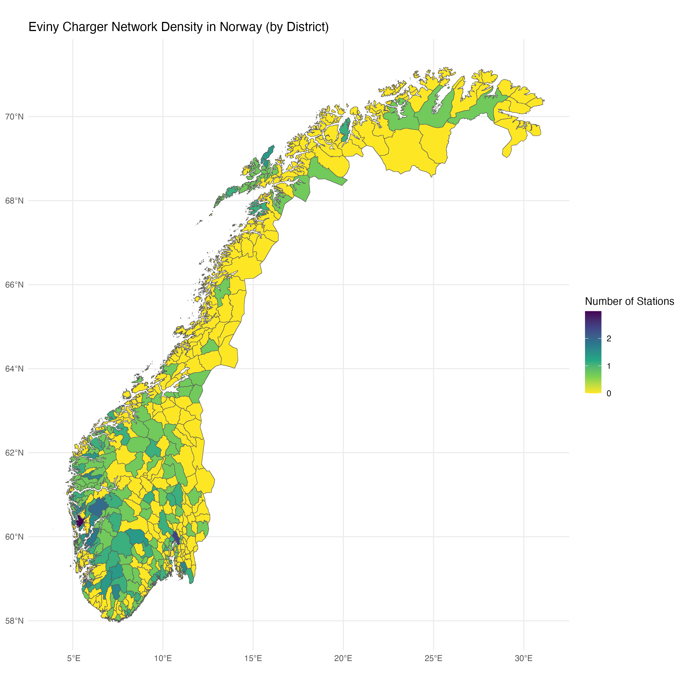

# Case Assignment - SurplusMap

# Charging Stations Data Extraction (extract_api.py)

This Python script extracts data from an API providing information about electric vehicle charging stations and saves the extracted data to a CSV file.

## Features

- **API Data Fetching**: Retrieves data from the specified API endpoint.
- **JSON Data Handling**: Loads and processes JSON data to extract relevant information.
- **Data Transformation**: Converts extracted data into a structured format using pandas.
- **CSV Export**: Saves the processed data into a CSV file for further analysis.

## Requirements

- Python packages: `requests`, `pandas`, `json`

## Usage

1. Ensure the required Python packages are installed.
2. Run the script to fetch data from the API and save it to `charger_info.csv`.

## Output Files

- `charger_info.csv`: A CSV file containing detailed information about charging stations, including station ID, name, connection type, charger ID, status, effect, tariff definition, and geographical coordinates.

# Charger Locations Visualization (viz_charger_loc.r)

This R script visualizes electric vehicle charger locations and their density across selected countries, with a focus on Norway. It uses spatial data to create maps and outputs visualizations as PNG files.

## Features

- **Data Loading**: Reads charger location data from a CSV file.
- **Spatial Data Handling**: Utilizes `sf` and `rnaturalearth` packages to manage spatial data.
- **Visualization**: 
  - Plots charger locations on a map of selected countries (Norway, Sweden, Denmark, Finland, Germany).
  - Visualizes charger station density by district in Norway using GADM data.
- **Output**: Saves visualizations as PNG files and exports a CSV with district-level charger counts.

## Requirements

- R packages: `sf`, `ggplot2`, `dplyr`, `rnaturalearth`, `rnaturalearthdata`, `viridis`

## Usage

1. Ensure the required R packages are installed.
2. Place the `charger_info.csv` and `gadm41_NOR_2.json` files in the working directory.
3. Run the script to generate visualizations and output files.

## Output Files

- `charger_locations.png`: Map of charger locations in selected countries.
- `charger_density_district_nor.png`: Map of charger density by district in Norway.
- `charger_density_district_nor.csv`: CSV file with district names and charger counts.

