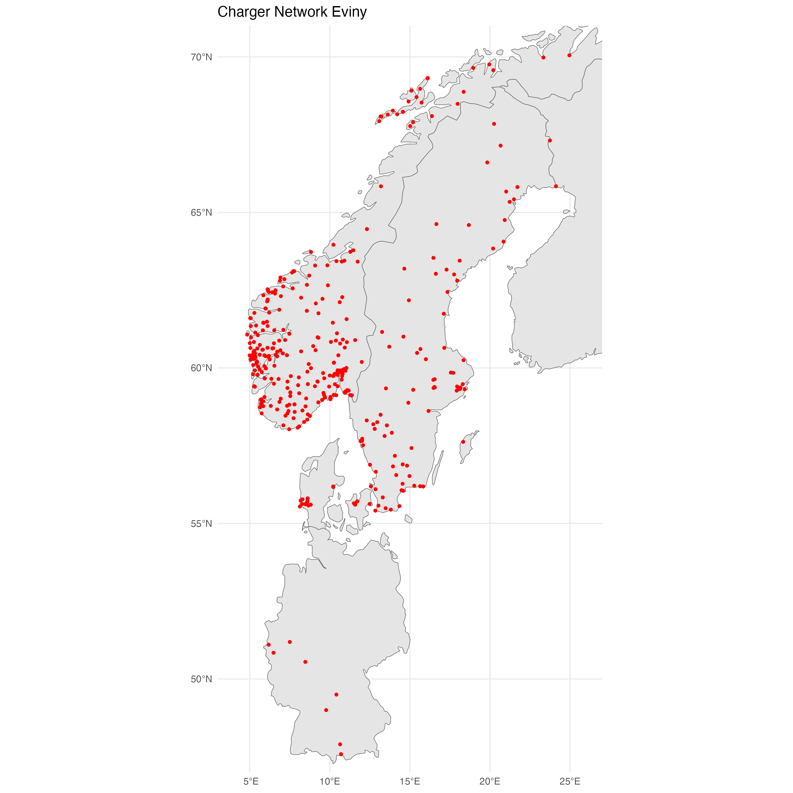
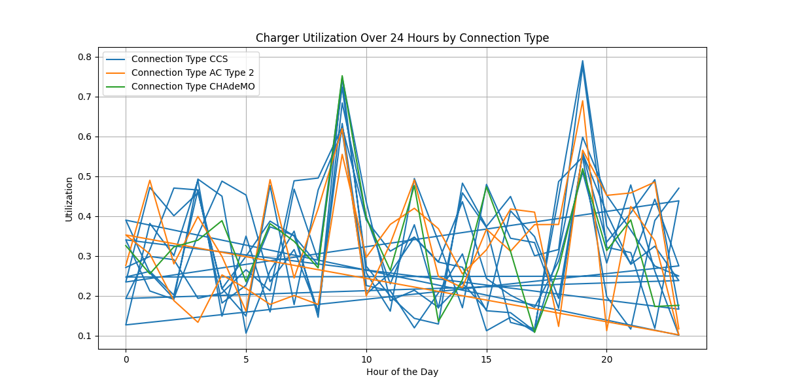
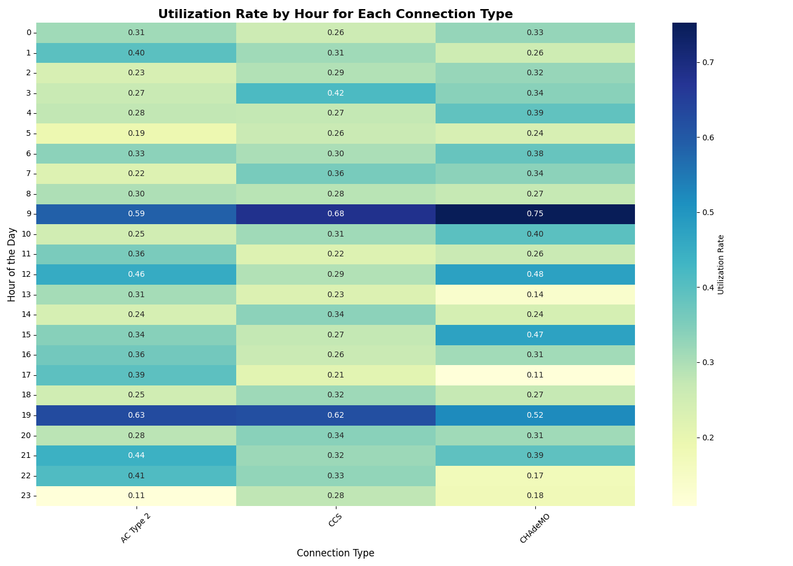

# Case Assignment - SurplusMap
Annotated scripts available under the `scripts` folder. Run the scripts in the order of the file names (1_extract_api.py to 3_simulate_utilization.py). The GADM shape files for Norway is available under the `data` folder, but can be downloaded from [here](https://gadm.org/). 

## Charging Stations Data Extraction (extract_api.py)

This Python script extracts data from an API providing information about electric vehicle charging stations and saves the extracted data to a CSV file.

### Features

- **API Data Fetching**: Retrieves data from the specified API endpoint.
- **JSON Data Handling**: Loads and processes JSON data to extract relevant information.
- **Data Transformation**: Converts extracted data into a structured format using pandas.
- **CSV Export**: Saves the processed data into a CSV file for further analysis.

### Requirements

- Python packages: `requests`, `pandas`, `json`

### Usage

1. Ensure the required Python packages are installed.
2. Run the script to fetch data from the API and save it to `charger_info.csv`.

### Output Files

- `charger_info.csv`: A CSV file containing detailed information about charging stations, including station ID, name, connection type, charger ID, status, effect, tariff definition, and geographical coordinates.

## Charger Locations Visualization (viz_charger_loc.r)

This R script visualizes electric vehicle charger locations and their density across selected countries, with a focus on Norway. It uses spatial data to create maps and outputs visualizations as PNG files.

### Features

- **Data Loading**: Reads charger location data from a CSV file.
- **Spatial Data Handling**: Utilizes `sf` and `rnaturalearth` packages to manage spatial data.
- **Visualization**: 
  - Plots charger locations on a map of selected countries (Norway, Sweden, Denmark, Finland, Germany).
  - Visualizes charger station density by district in Norway using GADM data.
- **Output**: Saves visualizations as PNG files and exports a CSV with district-level charger counts.

### Requirements

- R packages: `sf`, `ggplot2`, `dplyr`, `rnaturalearth`, `rnaturalearthdata`, `viridis`

### Usage

1. Ensure the required R packages are installed.
2. Place the `charger_info.csv` and `gadm41_NOR_2.json` files in the working directory.
3. Run the script to generate visualizations and output files.

### Output Files

- `charger_locations.png`: Map of charger locations in selected countries.
- `charger_density_district_nor.png`: Map of charger density by kommune/district in Norway.
- `charger_density_district_nor.csv`: CSV file with kommune/district names and charger counts.

## Charger Utilization Simulation (simulate_utilization.py)
Ideally, I'd would have liked to have used the sample the snapshots from the API to simulate the utilization of the chargers over time. However, due to time constraints, I've used a simplified approach to simulate the data for utilization over time. This Python script simulates the utilization of electric vehicle chargers over a 24-hour period

### Features

- **Data Import**: Loads charger information from a CSV file.
- **Utilization Simulation**: Simulates charger utilization on a scale of 0 (no users of charging station) to 1 (all users of charging station) over a fictional 24 hour period, with specific busy and non-busy times. 
- **Data Processing**: 
  - Selects a subset of chargers for detailed analysis.
  - Merges utilization data with charger connection type information.
- **CSV Export**: Saves the simulated utilization data to a CSV file.
- **Data Visualization**:
  - **Line Plot**: Shows utilization changes over time for selected chargers by connection type.
  - **Heatmap**: Visualizes the average utilization rate by hour for each connection type.

### Requirements

- Python packages: `pandas`, `numpy`, `matplotlib`, `seaborn`

### Usage

1. Ensure the required Python packages are installed.
2. Place the `charger_info.csv` file in the working directory.
3. Run the script to simulate utilization, save the data to `charger_utilization.csv`, and generate visualizations.

## Output Files

- `charger_utilization.csv`: A CSV file containing simulated utilization data for selected chargers.
- `charger_utilization_over_time.png`: A line plot showing utilization changes over time for selected chargers.
- `utilization_rate_by_hour_heatmap.png`: A heatmap illustrating the average utilization rate by hour for each connection type.

### Utilization Changes Over Time for Selected Chargers

### Utilization Rate by Hour Heatmap (0-1)

Following the above heatmap, we can see that the utilization rate is highest for all charger types at around 9:00am and 19:00pm, meaning that this is the time when most people are likely to charge their cars. 